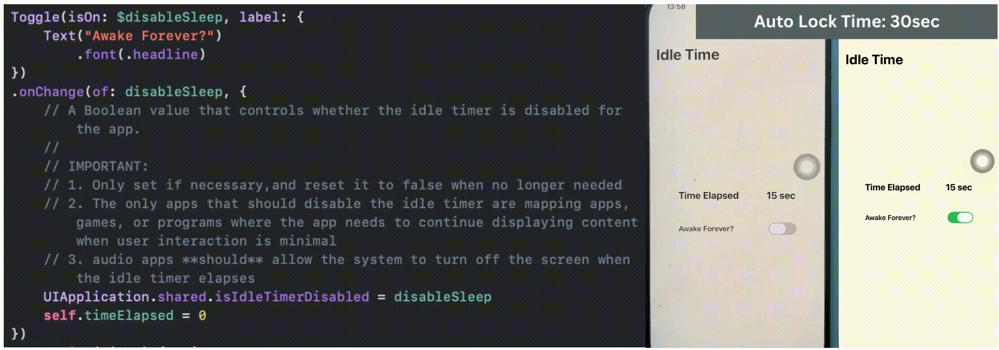

# SwiftUI_DisableScreenSleep

Depending on user's setting, the system dims the device screen, ie: puts the device into a "sleep" state, and eventually lock it after not receiving any user inputs (touches) for a short period of time.

To disable this behavior, we can set the `isIdleTimerDisabled` on `UIApplication` to avert system sleep.

For more details, please check out my blog [Little Swift/iOS Tip: iPhone, Stay Awake!](https://medium.com/@itsuki.enjoy/little-swift-ios-tip-iphone-stay-awake-9197f4b312af)

